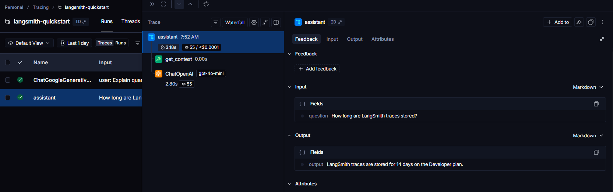
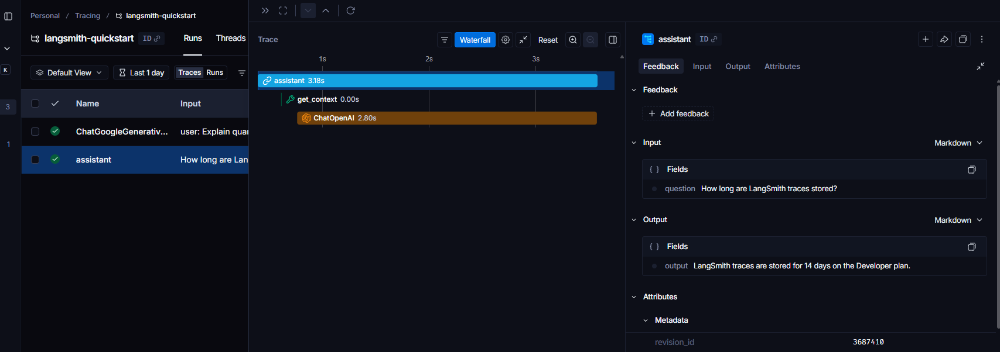

# LangSmith-Quickstart course

- LangSmith gives you end-to-end visibility into your LLM application by capturing `traces`; a complete record of every step that ran during a request, from the inputs passed in to the final output returned.

Before you begin, make sure you have:
    - A LangSmith account: Sign up or log in at [smith.langchain.com.](https://smith.langchain.com/)
    - A LangSmith API key: Follow the [Create an API key](https://docs.langchain.com/langsmith/create-account-api-key#create-an-api-key) guide.
    - An Google Gemini API Key: Generate this from [Google AI Studio](https://aistudio.google.com/app/api-keys)

- This example uses [Google Gemini models](https://ai.google.dev/gemini-api/docs) as the LLM provider. You can adapt it for your own provider.
  - You’ll instrument Gemini calls using the latest [`google-genai` SDK (Python)](https://googleapis.github.io/python-genai/)

## Set up your environment

- Create a project directory, install the dependencies, and configure the required environment variables:
  - If you are using Google Gemini, use the [Gemini wrapper](https://docs.langchain.com/langsmith/trace-with-google-gemini).

```bash
mkdir langsmith-quickstart && cd langsmith-quickstart
python -m venv .venv && source .venv/Scripts/activate
pip install -U langsmith google-genai openai python-dotenv
pip freeze > requirements.txt
```

## Setup

Set your API keys and project name: in `.env` file

```bash
LANGSMITH_API_KEY=<your_langsmith_api_key>
LANGSMITH_PROJECT=<your_project_name>
LANGSMITH_TRACING=true
GOOGLE_API_KEY=<your_google_api_key>
OPENAI_API_KEY="<your-openai-api-key>"
```

## Build the app

The following app uses two LangSmith tools to add tracing:

- `wrap_gemini`: This wrapper intercepts calls to the Gemini client and automatically logs them as traces in LangSmith.
- `@traceable`: wraps a function so its inputs, outputs, and any nested spans appear as a single trace in LangSmith.
- `wrap_openai`: wraps the OpenAI client so every LLM call is automatically logged as a nested span.

- Create a file called `openai_app.py` to work with open ai models.
  - The `assistant` function calls a tool (`get_context`) to retrieve relevant context, then passes that context to the model. Using `@traceable` on both functions captures the full pipeline in one trace, with the tool call and LLM call as nested spans.
- Create a file called `gemini_app.py` to work with gemini models.

- You can customize tracing by passing `tracing_extra` when calling `wrap_gemini()`. This parameter applies to all subsequent requests you make with that wrapped client, which allows you to attach tags and metadata for filtering and organizing traces in the LangSmith UI. The `tracing_extra` parameter accepts:
  - `tags`: A list of strings to categorize traces (for example, ["production", "gemini"]).
  - `metadata`: A dictionary of key-value pairs for additional context (for example, {"team": "ml-research", "integration": "google-genai"}).
  - `client`: An optional custom LangSmith client instance.

## Run the App

```bash
abhis@Tinku MINGW64 ~/Desktop/langchain-langraph-langsmith/langsmith-quickstart (main)
$ python openai_app.py
LangSmith traces are stored for 14 days on the Developer plan.
---
(.venv) 
abhis@Tinku MINGW64 ~/Desktop/langchain-langraph-langsmith/langsmith-quickstart (main)
$ python gemini_app.py
C:\Users\abhis\Desktop\langchain-langraph-langsmith\langsmith-quickstart\gemini_app.py:14: LangSmithBetaWarning: Function wrap_gemini is in beta.
  client = wrappers.wrap_gemini(
Imagine regular computers are like light switches: they are either ON or OFF. This is a "bit," representing a 0 or a 1.

Quantum computers are different because they use the strange rules of the super-tiny world (quantum mechanics). Here's how:

1.  **Qubits (Quantum Bits): More Than Just On or Off**
    *   Instead of just 0 or 1, a quantum bit (qubit) can be 0, 1, or **both at the same time**! This is called **superposition**.
    *   **Analogy:** Think of a coin. A regular coin can be heads (0) or tails (1) when it lands. A qubit is like a coin spinning in the air – while it's spinning, it's *both* heads and tails simultaneously. Only when it lands (or is "measured") does it decide whether it's 0 or 1.
    *   **Why it matters:** This "both at once" ability means a quantum computer can explore many possible solutions to a problem *simultaneously*, rather than one after another like a regular computer.
    ......
    .,..
    .
    .
    ..

```

## Traces in langsmith - different views

- I can see that each run is really an end-to-end execution of our application.

- On the left hand side, I've what we call a run tree. At the top, I can see the latency and a detailed breakdown of token usage.
- If I expand my left hand side view, I get a lot more detail on each step and the actions that took place within it.

- If I switch to this waterfall view, I can visualize how long each step took from start to finish, which is really nice.


- Now, you'll notice for each step or action I choose on the right hand side, I can see the input, maybe the output, some metadata tool calls, you know, even documents retrieved.

So tracing allows us to observe not just the final input and output of our application, but every single step taken within it.
